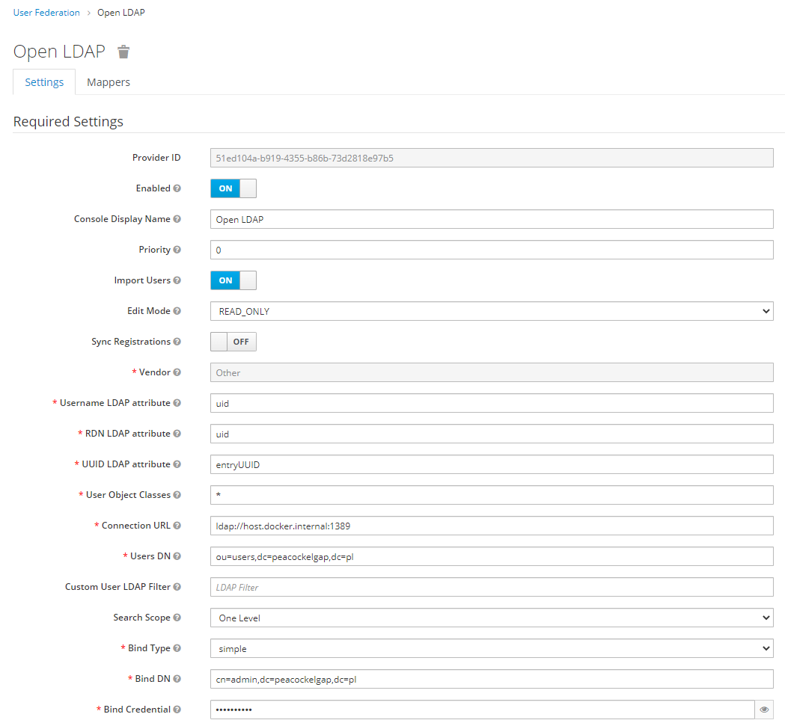
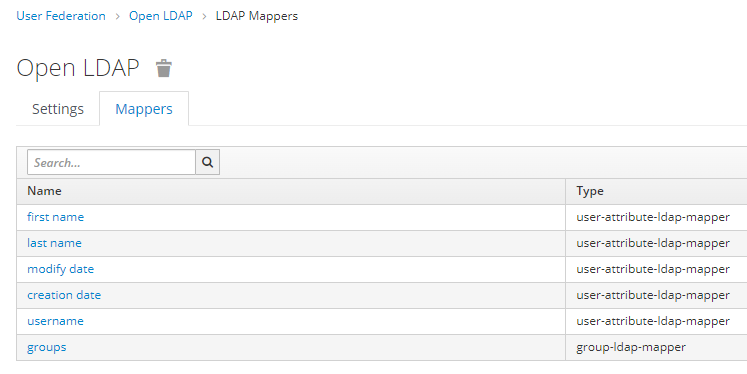
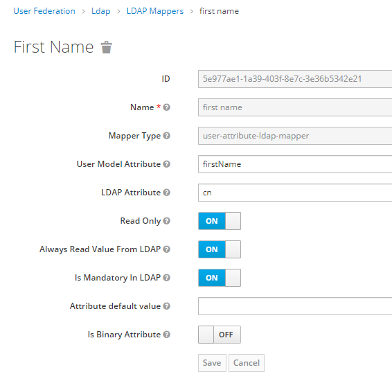
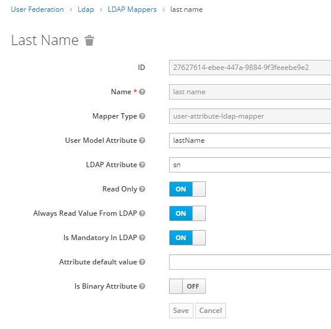
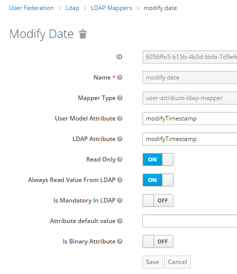
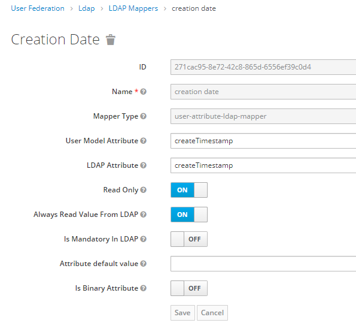
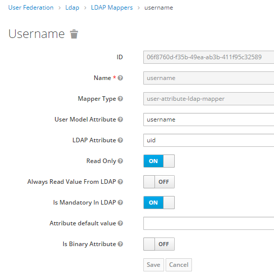
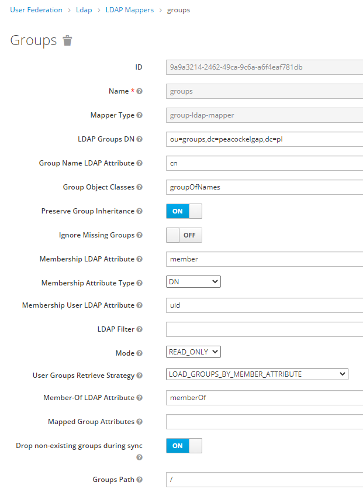

# Securing Camunda & Keycloak using Keycloak

<div style="color: red; font-size: xx-large">
Work in progress
</div>

## Overview
This example uses Open LDAP. When we use ActiveDirectory, it will be somehow different, but some similarities are expected ;-).

## Useful tools, interesting reading, general remarks
LDAP browser / editor --> https://directory.apache.org/studio/

If you are new to LDAP (just like me), you might find useful this reading --> https://www.zytrax.com/books/ldap/

Note, that LDAP is based on [X.500](https://en.wikipedia.org/wiki/X.500), [which leads us to mid 1980'](https://web.archive.org/web/20180825050315/http://x500standard.com/index.php?n=Ig.History), 
so please don't be surprised that in LDAP world you will find documents closer to punched paper tape than Facebook & Instagram.  
<hr/>

## Infrastructure
### Run PostgreSQL + Open LDAP + Keycloak + Camunda


```shell
# This script has to be executed in project root
docker-compose -f ./infrastructure/docker-compose.yaml up -d
```
Note, that on first run PostgreSQL initialization for Camunda schema / tables can last to long and Camunda will not be able to start properly.
Wait until PostgreSQL initialization ends, stop the service and run it again. It should start without any problem. 

### Stop PostgreSQL + Keycloak + Camunda
If you want to stop whole infrastructure, use the following script:
```shell
# This script has to be executed in project root
docker-compose -f ./infrastructure/docker-compose.yaml down
```
<hr/>

## Configure Keycloak

### Add LDAP federation
Keycloak --> User Federation --> Add provider... --> ldap


Name `host.docker.internal` in connection URL will work if you are using Docker Desktop on Windows (and probably also on Mac).
If you are using different docker implementation, you have to specify your machine IP (or name) here.

Note, that name `Open LDAP` is just a name and can be changed according to your needs :-).

### Enable authomatic synchronization
!LDAP synchronization](img_LDAP_synchronization.png)
Note, that periods are in seconds - do not synchronize to frequently ;-).

### Configure mappers















## Ideas
Keycloak & Azure AD --> https://www.youtube.com/watch?v=LYF-NLHD2uQ

Keycloak & Azure AD & Groups --> https://keycloak.discourse.group/t/groups-from-azure-ad/4876/3

Maybe we should use Identity Provider instead of User Federation?