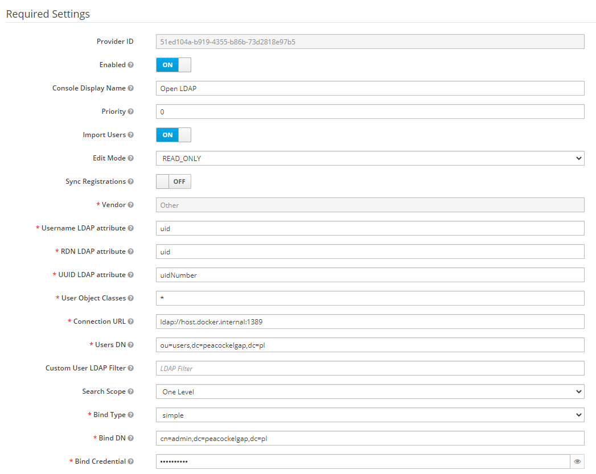

# Securing Camunda & Keycloak using Keycloak

<div style="color: red; font-size: xx-large">
Work in progress
</div>

## Infrastructure
### Run PostgreSQL + Open LDAP + Keycloak + Camunda


<span>&nbsp</span>

<span>&nbsp</span>

<span>&nbsp</span>


```shell
# This script has to be executed in project root
docker-compose -f ./infrastructure/docker-compose.yaml up -d
```
Note, that on first run PostgreSQL initialization for Camunda schema / tables can last to long and Camunda will not be able to start properly.
Wait until PostgreSQL initialization ends, stop the service and run it again. It should start without any problem. 

### Stop PostgreSQL + Keycloak + Camunda
```shell
# This script has to be executed in project root
docker-compose -f ./infrastructure/docker-compose.yaml down
```

## Configure Keycloak
Name `host.docker.internal` in connection URL will work if you are using Docker Desktop on Windows (and probably also on Mac).
If you are using different docker implementation, you have to specify your machine IP (or name) here.

